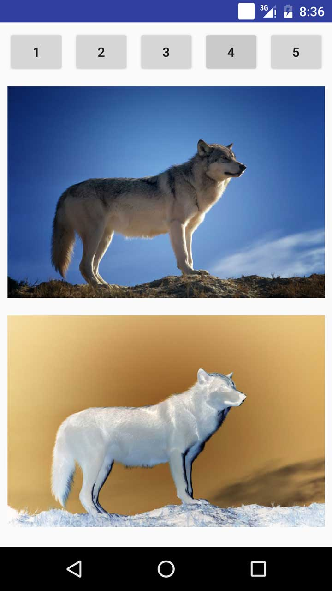
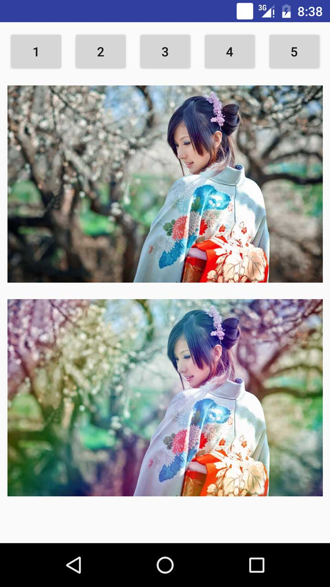

#ImageFilter简介
**ImageFilter是一个Android图片滤镜集合工具。**
###感谢daizhenjun实现的滤镜方法
####https://github.com/daizhenjun/ImageFilterForAndroid
###ImageFilter是什么?
* 一个滤镜集合
* 把相应的滤镜应用到ImageView中

###使用Gradle构建时添加一下依赖即可:

###使用方法
```
RainBowFilter filter = new RainBowFilter();
ImageFilter.showImageView(this, null, imageview, resourceId);
```



